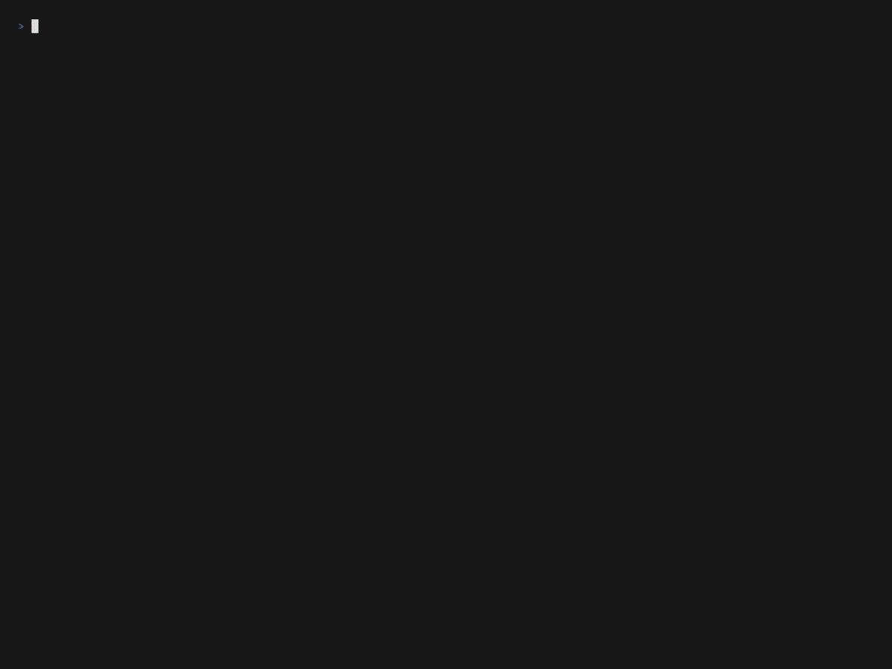
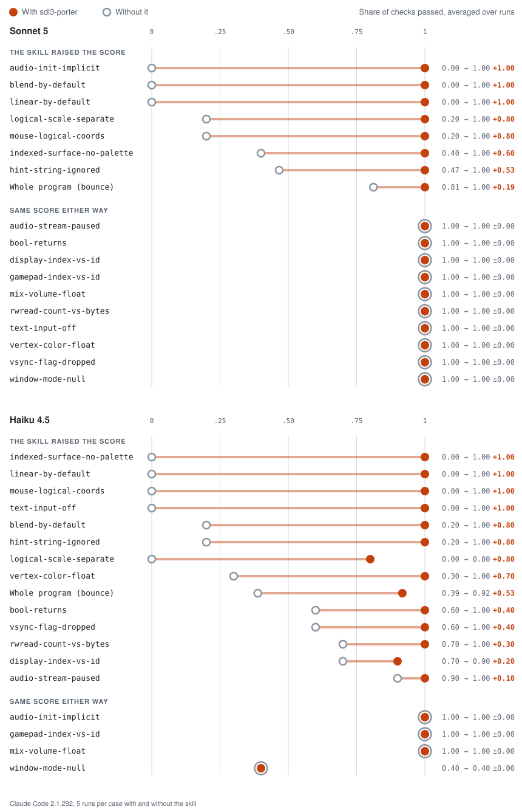

<h1>
  <picture>
    <source media="(prefers-color-scheme: dark)" srcset="docs/brand/lockup-dark.svg">
    
  </picture>
</h1>

**Port SDL2 code to SDL3 without the bugs that still compile.** sdl3-porter is an agent skill that ports C and C++ code from SDL2 to SDL3, then checks the port for the changes that build cleanly but break at runtime.

SDL's rename scripts handle most of a port, and the compiler catches most of the rest. Neither catches code that still compiles but now means something else. SDL3 functions return `true` on success, so a leftover `if (SDL_Init(...) != 0)` exits on every launch. A device opened with `SDL_OpenAudioDeviceStream` starts paused, so the ported game plays no sound. Textures now filter linearly by default, so pixel art blurs. Coding agents make the same mistakes, because most of the SDL code they learned from is SDL2.

> **Status:** v0.4.0, tested against SDL 3.2.0 and 3.4.18, and evaluated on Sonnet 5 and Haiku 4.5. [ROADMAP.md](ROADMAP.md) has what's next.



A real port of [`samples/bounce`](samples/bounce) with sdl3-porter 0.3.0 and Claude Opus 5.5, sped up 4×.

## Before and after

This port compiles against SDL3 without a warning:

```c
if (SDL_Init(SDL_INIT_VIDEO | SDL_INIT_AUDIO) != 0) {  // SDL3 returns true on success
    SDL_Log("SDL_Init failed: %s", SDL_GetError());
    return 1;                                          // so this runs on every launch
}

SDL_AudioStream *music = SDL_OpenAudioDeviceStream(
    SDL_AUDIO_DEVICE_DEFAULT_PLAYBACK, &spec, NULL, NULL);
SDL_PutAudioStreamData(music, samples, size);          // the device is paused: silence
```

The report after sdl3-porter fixes the port:

```text
3 traps found, 3 fixed

src/main.c:14     bool-returns         SDL_Init returns true on success, so `!= 0` exited on every launch.
src/audio.c:31    audio-stream-paused  SDL_OpenAudioDeviceStream starts paused. Added SDL_ResumeAudioStreamDevice.
src/sprites.c:9   linear-by-default    SDL_HINT_RENDER_SCALE_QUALITY no longer exists. Set SDL_SCALEMODE_NEAREST per texture.

Needs a human: check the window on a high-DPI display.
```

## Quick start

In Claude Code, add the marketplace and install the plugin:

```text
/plugin marketplace add hazeliscoding/sdl3-porter
/plugin install sdl3-porter@sdl3-porter
```

Then open your SDL2 project and ask Claude Code to port it to SDL3. The skill loads on its own, or you can start it with `/sdl3-porter:sdl3-porter`. Commit your work first, because the port is meant to be reviewed as a diff.

Python 3 on your `PATH` lets the skill run SDL's rename scripts. Without it, the agent renames by hand from the migration guide. With SDL3 installed, the skill builds the port and runs it where it can. Without SDL3, it compiles the changed files against the SDL3 headers it ships with, and its report says so.

## What's supported

- **SDL 3.2 and later.** The headers, migration guide and rename scripts that ship with the skill are pinned to SDL 3.4.18, and the fixtures run against it.
- **C and C++.** The build reference covers CMake, vendored SDL, pkg-config, `sdl2-config` and Makefiles, Windows DLLs, Linux, Emscripten and package managers.
- **Claude Code.** The skill is also a plain Agent Skill, but no other harness has been tested.
- **Out of scope:** SDL_image, SDL_ttf, SDL_mixer and SDL_net, whose includes the skill ports and whose calls it leaves for you; SDL 1.2; and language bindings.

## What it does

- **Decides whether to port.** If you only need your SDL2 game to run on SDL3, it recommends [sdl2-compat](https://github.com/libsdl-org/sdl2-compat) and asks before porting.
- **Runs SDL's own rename scripts.** Pinned copies ship with the skill, so every port starts from the same mechanical renames.
- **Fixes the build** one subsystem at a time: CMake, includes, `SDL_main.h`, then each compile error.
- **Sweeps for traps** in each subsystem you use, cites `file:line` for every one it finds, fixes it and tells you what still needs a human.

It covers core SDL3: init, events, video and OpenGL, the renderer, surfaces, input, audio, timers, the filesystem and file I/O (`SDL_IOStream`). SDL_image, SDL_ttf and SDL_mixer come later.

## Every trap is proven

- **Three programs per trap.** The SDL2 original, the naive port that compiles and fails, and the correct port. CI builds the original against SDL 2.32 and both ports against SDL 3.4.18, and runs all three headless on Windows, Linux and macOS (OpenGL traps on Linux). The original and the correct port must pass and the naive port must fail, or the trap doesn't ship.
- **Measured against no skill.** Evals run Claude Code with and without sdl3-porter on a small SDL2 program for each trap and on a whole game. The scores are below.
- **Sourced.** Each trap links the section of SDL's [migration guide](https://wiki.libsdl.org/SDL3/README-migration) it rests on.
- **Guidance isn't called a trap.** Some changes need hardware or a platform no headless test has, such as Nintendo face buttons, high DPI or Apple app bundles. The skill checks those by reading the code and reports them apart from the traps.

## Eval scores

Claude Code ported each trap's SDL2 sample, and the bounce game, five times with sdl3-porter and five times without it, on Sonnet 5 and on Haiku 4.5. Each grader checks for one trap fixed or one porting step done. With the skill, Haiku runs out of the whole game's 60 turns in most runs, which is most of its gap there.

<!-- eval-table:start -->
<picture>
  <source media="(prefers-color-scheme: dark)" srcset="docs/evals/scores-dark.svg">
  
</picture>

| Case | Sonnet 5 with skill | without | Haiku 4.5 with skill | without |
|---|---|---|---|---|
| `audio-init-implicit` | 1.00 | 0.20 | 1.00 | 0.80 |
| `audio-stream-paused` | 1.00 | 1.00 | 1.00 | 0.90 |
| `blend-by-default` | 1.00 | 0.00 | 1.00 | 0.20 |
| `bool-returns` | 1.00 | 1.00 | 1.00 | 0.80 |
| `display-index-vs-id` | 1.00 | 1.00 | 1.00 | 1.00 |
| `gamepad-index-vs-id` | 1.00 | 1.00 | 1.00 | 1.00 |
| `hint-string-ignored` | 1.00 | 0.33 | 0.93 | 0.07 |
| `indexed-surface-no-palette` | 1.00 | 0.00 | 1.00 | 0.20 |
| `linear-by-default` | 1.00 | 0.00 | 1.00 | 0.00 |
| `logical-scale-separate` | 1.00 | 0.60 | 1.00 | 0.00 |
| `mix-volume-float` | 1.00 | 1.00 | 1.00 | 0.20 |
| `mouse-logical-coords` | 1.00 | 0.00 | 1.00 | 0.00 |
| `rwread-count-vs-bytes` | 1.00 | 1.00 | 1.00 | 0.60 |
| `text-input-off` | 1.00 | 1.00 | 1.00 | 0.00 |
| `vertex-color-float` | 1.00 | 1.00 | 1.00 | 0.00 |
| `vsync-flag-dropped` | 1.00 | 1.00 | 1.00 | 0.60 |
| `window-mode-null` | 1.00 | 1.00 | 1.00 | 0.80 |
| Whole program (`samples/bounce`) | 1.00 | 0.86 | 0.87 | 0.42 |

`claude-sonnet-5` and `claude-haiku-4-5-20251001`, Claude Code 2.1.292, 5 runs per case with and without the skill, 2026-10-06. The skill loaded in 90 of 90 Sonnet 5 runs and 89 of 90 Haiku 4.5 runs with it installed. A score is the share of a case's graders that passed, not counting `skill-fired`, averaged over its runs. Generated by `evals/readme_table.py`.
<!-- eval-table:end -->

## Stability

Before 1.0, anything can change in a minor release, and the release notes say what did. From 1.0, these stay fixed across every 1.x release:

- **The names:** the plugin `sdl3-porter` and its skill, `sdl3-porter:sdl3-porter`.
- **The trap ids.** Any release can add traps, but an id is never renamed or reused.
- **The report format:** the `N traps found` line, one line per trap with `file:line` and the trap id, then `Also changed:`, `Build:`, `Not checked:` and `Needs a human:`. A release can add new kinds of line, but not change these.
- **The oldest supported SDL3**, 3.2.0, which CI tests on every change.

Only a major version may change one of these, or remove a trap. Minor releases add traps, guidance and subsystems, and move the pinned SDL to the latest SDL 3 release. Patch releases fix mistakes.

## Contributing

Each trap is one reference entry, three small fixture programs, and one eval case with its own SDL2 sample. [CONTRIBUTING.md](CONTRIBUTING.md) explains how to add one, and the **Missed trap** issue form is the place to report one the skill didn't catch.

## License

[zlib](LICENSE), like SDL. sdl3-porter is an independent project and is not affiliated with the SDL project.
